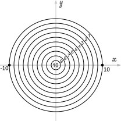

# Aim
Вам предстоит определить количество баллов за попадание выстрела в мишень. Мишень разбита на 10 круговых зон как
показано на рисунке. Чем ближе попадание к центру мишени, тем больше баллов. Каждая зона помечена числом — это
количество баллов, которое присуждается за попадание в данную зону. Попадание задается координатами в системе координат
с центом, совпадающим с центром мишени. Круги мишени расположены друг от друга на расстоянии 1. Радиус всей мишени 10.
Попадание в границу зон оценивается меньшим баллом, например выстрел в точку (10, 0) дает 0 баллов.       

### Исходные данные
На вход вашей функции передается один аргумент — объект, содержащий координаты `x` и `y` попадания.

### Результат
Ваша функция должна вернуть одно число — количество баллов за выстрел.

### Пример

| Выходные данные | Результат |
|-----------------|-----------|
| `0 0`           | `10`      |
| `1.32 3.29`     | `7`       |
| `100 100`       | `0`       |

