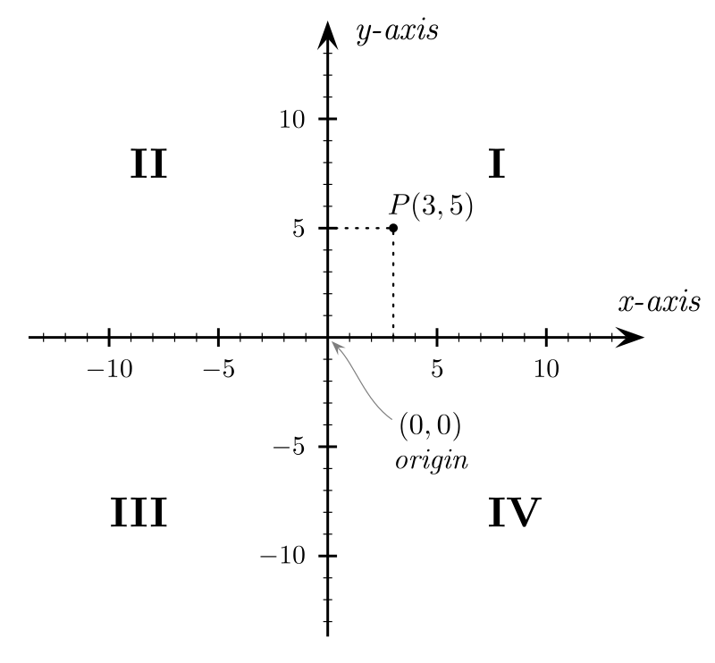

# Quadrants

На плоской системе координат задана точка с координатами (`x`, `y`). Требуется определить номер квадранта, где находится
эта точка. Если определить квадрант невозможно, то считаем, что точка в нулевом квадранте. В данной системе координат
есть четыре квадратна, которые определяются как указано на рисунке ниже. Например, точка `P` с координатами (`3`, `5`)
находится в первом квадранте.

### Исходные данные
На вход вашей функции передается один аргумент — объект, содержащий координаты `x` и `y` точки.

### Результат
Ваша функция должна вернуть одно целое число — ответ на задачу от (0 до 4 включительно).

### Пример

| Выходные данные | Результат |
|-----------------|-----------|
| `3 5`           | `1`       |
| `0 0`           | `0`       |

